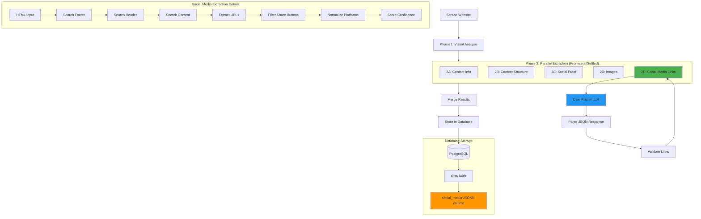

# Social Media Extraction - Quick Implementation Guide

## Overview
This guide provides step-by-step instructions to implement Phase 2E (Social Media Extraction) in the LLM-based scraping system.

## Architecture Diagram



## Data Flow Diagram

```
┌─────────────────────────────────────────────────────────────────┐
│                        SCRAPING SYSTEM                           │
└─────────────────────────────────────────────────────────────────┘
                                │
                                ▼
┌─────────────────────────────────────────────────────────────────┐
│  Phase 1: Visual Analysis (grok-2-vision)                       │
│  • Brand colors                                                  │
│  • Logo detection                                                │
│  • Typography                                                    │
└─────────────────────────────────────────────────────────────────┘
                                │
                                ▼
┌─────────────────────────────────────────────────────────────────┐
│  Phase 2: Parallel Extraction (grok-code-fast-1)                │
│                                                                   │
│  ┌──────────┐ ┌──────────┐ ┌──────────┐ ┌──────────┐ ┌────────┐│
│  │   2A:    │ │   2B:    │ │   2C:    │ │   2D:    │ │  2E:   ││
│  │ Contact  │ │ Content  │ │  Social  │ │  Images  │ │ Social ││
│  │   Info   │ │Structure │ │  Proof   │ │          │ │ Media  ││
│  └──────────┘ └──────────┘ └──────────┘ └──────────┘ └────────┘│
│       │            │             │            │           │      │
│       └────────────┴─────────────┴────────────┴───────────┘      │
│                                │                                  │
└────────────────────────────────┼──────────────────────────────────┘
                                 ▼
                    ┌────────────────────────┐
                    │  Merge Results into    │
                    │ ExtractedBusinessInfo  │
                    └────────────────────────┘
                                 │
                                 ▼
                    ┌────────────────────────┐
                    │  Store in Database     │
                    │  (sites.social_media)  │
                    └────────────────────────┘
```

## Phase 2E Extraction Flow

```
HTML Input
    │
    ▼
┌─────────────────────────────────────────┐
│  buildSocialMediaExtractionPrompt()    │
│  • Add context (URL, business name)     │
│  • Include HTML content                 │
└─────────────────────────────────────────┘
    │
    ▼
┌─────────────────────────────────────────┐
│  LLM Analysis                           │
│  Model: grok-code-fast-1                │
│                                          │
│  1. Search footer for social links      │
│  2. Search header for social links      │
│  3. Identify platform types             │
│  4. Extract URLs and usernames          │
│  5. Filter out share buttons            │
│  6. Score confidence                    │
└─────────────────────────────────────────┘
    │
    ▼
┌─────────────────────────────────────────┐
│  JSON Response                          │
│  {                                       │
│    socialLinks: [                       │
│      {                                   │
│        platform: "facebook",            │
│        url: "...",                      │
│        confidence: 0.95,                │
│        location: "footer",              │
│        extractionMethod: "direct_link"  │
│      }                                   │
│    ],                                    │
│    extractionMetadata: {...}            │
│  }                                       │
└─────────────────────────────────────────┘
    │
    ▼
┌─────────────────────────────────────────┐
│  Validation                             │
│  • hasMinimumSocialMediaData()          │
│  • Confidence >= 0.3                    │
│  • At least 1 social link               │
└─────────────────────────────────────────┘
    │
    ▼
┌─────────────────────────────────────────┐
│  Merge into ExtractedBusinessInfo       │
└─────────────────────────────────────────┘
```

## Implementation Steps

### Step 1: Create Prompt File
**File:** `/src/lib/scraping/prompts/social-media-extraction-prompt.ts`

Status: ✅ **COMPLETED** (already created above)

### Step 2: Update Extraction Schemas
**File:** `/src/lib/types/extraction-schemas.ts`

Status: ✅ **COMPLETED** (already updated above)

Changes made:
- Added `SocialMediaExtractionResponse` interface
- Added `hasMinimumSocialMediaData()` type guard
- Updated `ExtractionMetadata` to include `phase2eComplete`

### Step 3: Add Extraction Function
**File:** `/src/lib/scraping/llm-extractor.ts`

Add the following function after the existing Phase 2 extraction functions:

```typescript
/**
 * Phase 2E: Extract social media links
 */
async function extractSocialMedia(
  textHtml: string,
  baseUrl: string,
  businessName?: string
): Promise<SocialMediaExtractionResponse | undefined> {
  try {
    const userPrompt = buildSocialMediaExtractionPrompt({
      html: textHtml,
      url: baseUrl,
      businessName
    });

    if (EXTRACTION_FLAGS.LOG_PROMPTS) {
      console.log('[LLM Extraction] Phase 2E prompt:', userPrompt.substring(0, 500));
    }

    const response = await generateWithOpenRouter<SocialMediaExtractionResponse>(
      userPrompt,
      SOCIAL_MEDIA_EXTRACTION_SYSTEM_PROMPT,
      PHASE2_OPTIONS,
      EXTRACTION_MODELS.TEXT
    );

    // Validate response has minimum social media data
    if (!hasMinimumSocialMediaData(response.content)) {
      console.warn('[LLM Extraction] Phase 2E returned no valid social links');
      return undefined;
    }

    return response.content;
  } catch (error: unknown) {
    const errorInfo = handleError(error);
    console.error('[LLM Extraction] Phase 2E extraction error:', errorInfo.message);
    return undefined;
  }
}
```

### Step 4: Update Parallel Execution
**File:** `/src/lib/scraping/llm-extractor.ts`

In the `extractBusinessInfoWithLLM()` function, update the Phase 2 execution:

**BEFORE:**
```typescript
const phase2Results = await Promise.allSettled([
  extractContactInfo(textHtml, baseUrl),
  extractContentStructure(textHtml, baseUrl),
  extractSocialProof(textHtml, baseUrl),
  extractImages(imageHtml, baseUrl)
]);
```

**AFTER:**
```typescript
const phase2Results = await Promise.allSettled([
  extractContactInfo(textHtml, baseUrl),
  extractContentStructure(textHtml, baseUrl),
  extractSocialProof(textHtml, baseUrl),
  extractImages(imageHtml, baseUrl),
  extractSocialMedia(textHtml, baseUrl, contentData?.businessDescription) // NEW
]);
```

### Step 5: Add Result Extraction
**File:** `/src/lib/scraping/llm-extractor.ts`

Add variable declaration after the existing Phase 2 variables:

```typescript
let socialMediaData: SocialMediaExtractionResponse | undefined;
```

Add result extraction after Phase 2D:

```typescript
// Phase 2E: Social media links
if (phase2Results[4].status === 'fulfilled') {
  socialMediaData = phase2Results[4].value;
  metadata.phase2eComplete = true;

  if (EXTRACTION_FLAGS.LOG_METRICS) {
    console.log('[LLM Extraction] Phase 2E complete:');
    console.log(`  Social links found: ${socialMediaData?.socialLinks.length || 0}`);
    const platforms = socialMediaData?.socialLinks.map(l => l.platform).join(', ') || 'none';
    console.log(`  Platforms: ${platforms}`);
    console.log(`  Confidence: ${socialMediaData?.confidence}`);
  }
} else {
  const errorInfo = handleError(phase2Results[4].reason);
  metadata.errors?.push(`Phase 2E failed: ${errorInfo.message}`);
  console.warn(`[LLM Extraction] Phase 2E failed: ${errorInfo.message}`);
}
```

### Step 6: Update Merge Function
**File:** `/src/lib/scraping/llm-extractor.ts`

Update the `mergeExtractionResults()` function signature:

**BEFORE:**
```typescript
function mergeExtractionResults(
  visual?: VisualBrandAnalysisResponse,
  contact?: ContactExtractionResponse,
  content?: ContentExtractionResponse,
  socialProof?: SocialProofExtractionResponse,
  images?: ImageExtractionResponse,
  metadata?: ExtractionMetadata
): ExtractedBusinessInfo {
```

**AFTER:**
```typescript
function mergeExtractionResults(
  visual?: VisualBrandAnalysisResponse,
  contact?: ContactExtractionResponse,
  content?: ContentExtractionResponse,
  socialProof?: SocialProofExtractionResponse,
  images?: ImageExtractionResponse,
  socialMedia?: SocialMediaExtractionResponse, // NEW
  metadata?: ExtractionMetadata
): ExtractedBusinessInfo {
```

Add social media merging logic before the return statement:

```typescript
  // Add social media links
  if (socialMedia && hasMinimumSocialMediaData(socialMedia)) {
    result.socialMedia = socialMedia.socialLinks.map(link => ({
      platform: link.platform,
      url: link.url,
      username: link.username,
      confidence: link.confidence
    }));
  }
```

Update the merge function call to include socialMediaData:

**BEFORE:**
```typescript
return mergeExtractionResults(visualData, contactData, contentData, socialProofData, imageData, metadata);
```

**AFTER:**
```typescript
return mergeExtractionResults(visualData, contactData, contentData, socialProofData, imageData, socialMediaData, metadata);
```

### Step 7: Update Import Statements
**File:** `/src/lib/scraping/llm-extractor.ts`

Add to existing imports:

```typescript
import {
  SOCIAL_MEDIA_EXTRACTION_SYSTEM_PROMPT,
  buildSocialMediaExtractionPrompt
} from './prompts/social-media-extraction-prompt';
```

Update the extraction schemas import:

```typescript
import type {
  VisualBrandAnalysisResponse,
  ContactExtractionResponse,
  ContentExtractionResponse,
  SocialProofExtractionResponse,
  ImageExtractionResponse,
  SocialMediaExtractionResponse, // NEW
  ExtractionMetadata
} from '@/lib/types/extraction-schemas';
```

Update the type guards import:

```typescript
import {
  hasMinimumBrandData,
  hasMinimumContactData,
  hasMinimumContentData,
  hasMinimumImageData,
  hasMinimumSocialMediaData // NEW
} from '@/lib/types/extraction-schemas';
```

### Step 8: Update ExtractedBusinessInfo Type
**File:** `/src/lib/scraping/content-extractor.ts`

Add social media field to the type:

```typescript
export interface ExtractedBusinessInfo {
  // ... existing fields ...

  // Social media links
  socialMedia?: Array<{
    platform: string;
    url: string;
    username?: string;
    confidence: number;
  }>;
}
```

### Step 9: Update Metadata Initialization
**File:** `/src/lib/scraping/llm-extractor.ts`

Update the metadata initialization:

```typescript
const metadata: ExtractionMetadata = {
  phase1Complete: false,
  phase2aComplete: false,
  phase2bComplete: false,
  phase2cComplete: false,
  phase2dComplete: false,
  phase2eComplete: false, // NEW
  success: false,
  usedFallback: false,
  errors: [],
  warnings: []
};
```

### Step 10: Create Database Migration
**File:** `/supabase/migrations/YYYYMMDDHHMMSS_add_social_media_to_sites.sql`

```sql
-- Add social media links to sites table
-- Stores extracted social media profile URLs as JSONB array

ALTER TABLE public.sites
ADD COLUMN social_media JSONB DEFAULT '[]';

-- Add index for efficient queries
CREATE INDEX idx_sites_social_media
ON public.sites USING GIN (social_media);

-- Add helpful comments
COMMENT ON COLUMN public.sites.social_media IS 'Extracted social media profile URLs with platform identification and confidence scores';

-- Example query to find sites with Instagram
-- SELECT * FROM sites WHERE social_media @> '[{"platform": "instagram"}]';

-- Example query to count sites by platform
-- SELECT
--   elem->>'platform' as platform,
--   COUNT(*) as count
-- FROM sites, jsonb_array_elements(social_media) elem
-- GROUP BY elem->>'platform';
```

### Step 11: Update Database Types
After running the migration, regenerate TypeScript types:

```bash
pnpm generate-types
```

### Step 12: Testing

Create test file: `/src/lib/scraping/__tests__/social-media-extraction.test.ts`

```typescript
import { extractBusinessInfoWithLLM } from '../llm-extractor';

describe('Social Media Extraction (Phase 2E)', () => {
  test('extracts social links from footer', async () => {
    const html = `
      <footer>
        <nav class="social-links">
          <a href="https://facebook.com/mybusiness" aria-label="Facebook">
            <i class="fa-facebook"></i>
          </a>
          <a href="https://instagram.com/mybusiness" aria-label="Instagram">
            <i class="fa-instagram"></i>
          </a>
        </nav>
      </footer>
    `;

    const result = await extractBusinessInfoWithLLM(html, 'https://example.com');

    expect(result.socialMedia).toBeDefined();
    expect(result.socialMedia?.length).toBeGreaterThan(0);
    expect(result.socialMedia?.find(s => s.platform === 'facebook')).toBeDefined();
    expect(result.socialMedia?.find(s => s.platform === 'instagram')).toBeDefined();
  });

  test('excludes social sharing buttons', async () => {
    const html = `
      <div class="share-buttons">
        <a href="https://facebook.com/sharer.php?u=...">Share on Facebook</a>
        <a href="https://twitter.com/intent/tweet?text=...">Tweet this</a>
      </div>
    `;

    const result = await extractBusinessInfoWithLLM(html, 'https://example.com');

    // Should not extract sharing buttons
    expect(result.socialMedia?.length || 0).toBe(0);
  });

  test('normalizes Twitter/X URLs', async () => {
    const html = `
      <footer>
        <a href="https://twitter.com/mybusiness">Twitter</a>
      </footer>
    `;

    const result = await extractBusinessInfoWithLLM(html, 'https://example.com');

    const twitterLink = result.socialMedia?.find(s => s.platform === 'x' || s.platform === 'twitter');
    expect(twitterLink).toBeDefined();
  });
});
```

Run tests:
```bash
pnpm test social-media-extraction
```

## Verification Checklist

- [ ] Prompt file created with comprehensive instructions
- [ ] Schema types added and exported
- [ ] Type guard function implemented
- [ ] Extraction function added to llm-extractor.ts
- [ ] Phase 2 parallel execution updated
- [ ] Result extraction logic added
- [ ] Merge function updated
- [ ] Import statements updated
- [ ] ExtractedBusinessInfo type updated
- [ ] Metadata initialization updated
- [ ] Database migration created and run
- [ ] TypeScript types regenerated
- [ ] Unit tests created and passing
- [ ] Integration test with real HTML
- [ ] Logs showing Phase 2E execution
- [ ] Database records contain social_media JSONB

## Expected Output

After implementation, scraping logs should show:

```
[LLM Extraction] Preprocessed HTML:
  Visual HTML: 12543 bytes
  Text HTML: 8976 bytes
  Image HTML: 6543 bytes

[LLM Extraction] Phase 1 complete:
  Brand colors: 3
  Logo: found
  Confidence: 0.92

[LLM Extraction] Phase 2A complete:
  Emails: 1
  Phones: 1
  Confidence: 0.88

[LLM Extraction] Phase 2B complete:
  Site title: My Business
  Key features: 4
  Confidence: 0.85

[LLM Extraction] Phase 2C complete:
  Testimonials: 3
  Services: 5
  Confidence: 0.82

[LLM Extraction] Phase 2D complete:
  Images found: 8
  Hero images: 2
  Confidence: 0.90

[LLM Extraction] Phase 2E complete:        <-- NEW
  Social links found: 4                      <-- NEW
  Platforms: facebook, instagram, x, yelp    <-- NEW
  Confidence: 0.93                           <-- NEW

[LLM Extraction] Successfully extracted business info
  Total phases complete: 6/6
  Duration: 18.4s
```

Database record:

```json
{
  "id": "...",
  "name": "My Business",
  "social_media": [
    {
      "platform": "facebook",
      "url": "https://facebook.com/mybusiness",
      "username": "mybusiness",
      "confidence": 0.95
    },
    {
      "platform": "instagram",
      "url": "https://instagram.com/mybusiness",
      "username": "mybusiness",
      "confidence": 0.93
    },
    {
      "platform": "x",
      "url": "https://x.com/mybusiness",
      "username": "mybusiness",
      "confidence": 0.90
    },
    {
      "platform": "yelp",
      "url": "https://yelp.com/biz/mybusiness",
      "confidence": 0.88
    }
  ]
}
```

## Troubleshooting

### Issue: Phase 2E not executing
**Solution:** Check that `extractSocialMedia` is added to the `Promise.allSettled` array

### Issue: No social links extracted
**Solution:**
1. Check `EXTRACTION_FLAGS.LOG_PROMPTS` to see what HTML is being sent
2. Verify the website actually has social links
3. Check confidence threshold (must be >= 0.3)

### Issue: TypeScript errors on socialMedia field
**Solution:**
1. Ensure `ExtractedBusinessInfo` type is updated
2. Run `pnpm typecheck` to find specific errors
3. Regenerate database types if needed

### Issue: Database column doesn't exist
**Solution:**
1. Run the migration: `pnpm supabase:migrate`
2. Regenerate types: `pnpm generate-types`
3. Restart dev server

## Next Steps

After implementation:

1. **Monitor extraction accuracy** - Check logs for Phase 2E completion rate
2. **Validate extracted links** - Manually verify a sample of extracted social links
3. **Add UI components** - Display social icons on generated sites
4. **Track analytics** - Monitor which platforms are most common
5. **Optimize prompts** - Refine based on extraction accuracy
